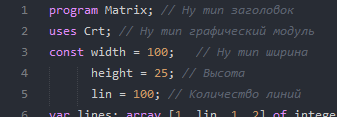
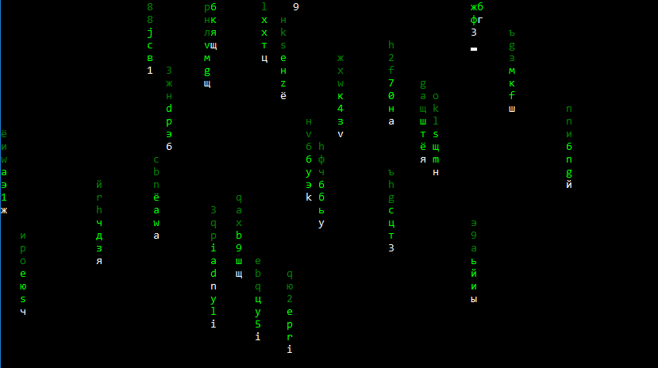

# MatrixPascal
Crt Matrix in Pascal

Скрипт создавался со стандартными библиотеками PascalABC.NET, поэтому возможно присутствие нерешённых ошибок и багов.

## Настройка скрипта

Для удобстава использования, и настройки визуального оформления, большинство основных переменных реализованы в виде констант и находятся в начале документа:

Таким образом, изменяя значения констант, можно добиться желаемого визуального эффекта.

Так же, есть два варианта оформления падающих линий: 
1) 
2) 

Что бы работал первый вариант оформления, необходимо закомментировать(Поставить // в начале строки) или удалить строки: 19, 23 и 25 и раскомментировать (Убрать //) 24 строку.

Что бы работал вариант 2, надо раскомментировать строки 19, 23 и 25, и закомментировать или удалить строку 24.

По стандарту включен вариант 1.
